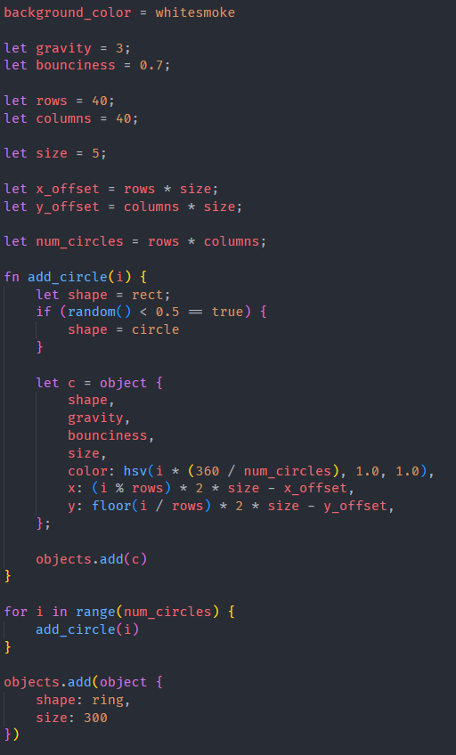

# phyx-script-programming-language README

Adds syntax highlighting and icons for my custom [Phyx Script programming language](https://github.com/ProfessorQu/phyx-script).

## Features

### Syntax Highlighting

It highlights the syntax of `.phyx` files according to the language.

### Icons

It also adds this neat icon to all `.phyx` files:

Which I got from [PNG Repo](https://www.pngrepo.com/svg/258820/atomic-physics).

## Known Issues

There are no know issues.

## Release Notes

### 1.0.0

Initial release of Phyx Script Programming Language

---
